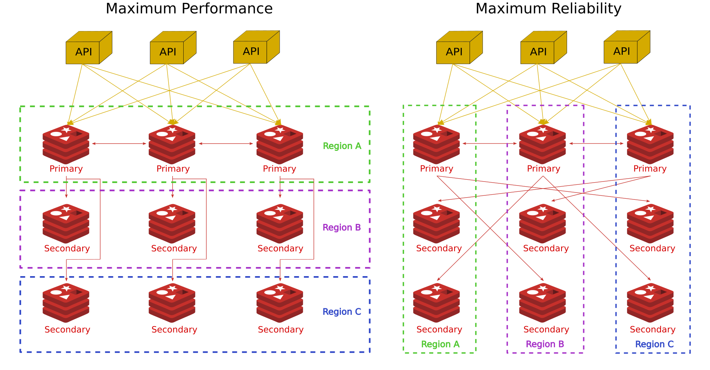
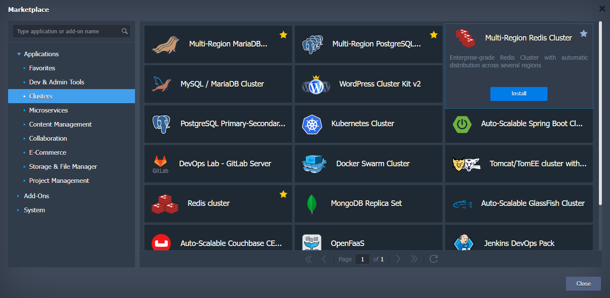
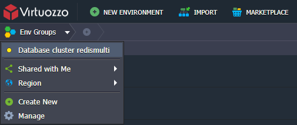
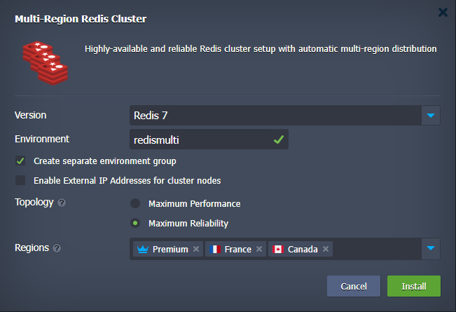
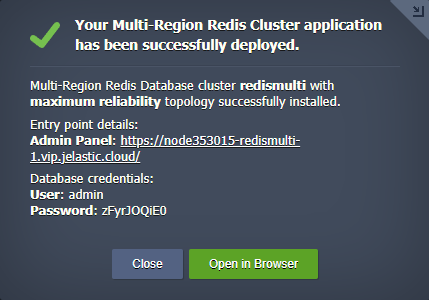
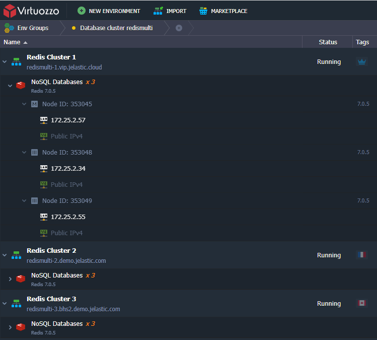
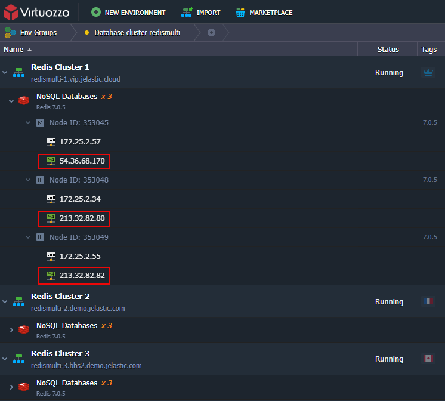

 

## Redis Automatic Сlustering Across Different Regions with Automatic Failover

Redis Mulit-Region Cluster is a distributed implementation of Redis where data is sharded between cluster nodes located in different Regions with the following goals in order of importance in the design: 

 - High performance and linear scalability. There are no proxies, asynchronous replication is used, and no merge operations are performed on values. 

 - Acceptable degree of write safety: the system tries (in a best-effort way) to retain all the writes originating from clients connected with the majority of the master nodes. Usually there are small windows where acknowledged writes can be lost. Windows to lose acknowledged writes are larger when clients are in a minority partition. 

 - Availability: Redis Cluster is able to survive partitions where the majority of the master nodes are reachable and there is at least one reachable replica for every master node that is no longer reachable. Moreover, using replicas migration, masters no longer replicated by any replica will receive one from a master which is covered by multiple replicas 

### Database Topology

Redis Multi-Region cluster for Cross-Region deployments consists of groups of nodes deployed into different Regions depending on their roles and required level of high-availability. The required minumum number of nodes in the cluster is three. Thus two topologies can be created:  

1. **Maximum performance**. This topology ensures maximum performance and horizontal scalability. 

2. **Maximum Reliability**. This solution is not scalable and requires three regions a must but ensures extremely high-availability even one or two data centeres fail.

 

### High Availability and Failover

Main purpose of Cross-Region DB clusters is high availability and failover capabilities. Thus, depending on the selected topology the cluster will keep working for:

 - **Maximum performance** topology when one or two nodes fail 

 - **Maximum Reliability** topology when one, or two nodes fail or even one or two Regions become unavailable

if one or two nodes fail in any Region or even whole Region fails the cluster will be available depending on selected topology. In case one of cluster nodes fails both topologies ensure no downtime cluster work. 
For the **Maximum Performance** topology upon cluster installation, customer is able to select "Primary" Region that should host Primary servers and "Secondary" Regions that should host Secondary database servers also known as **Replicas**.

### Installation Process

Go to [VAP Marketplace](https://www.virtuozzo.com/application-platform-docs/marketplace/), find **Multi-Region Redis Cluster** application and run it. 

Since PaaS allows to place one environment per one region only, the Multi-Region installation stipulates creating Multi-Environment topology. In order to distinguish one Multi-Region installation from another we create [Environment Group](https://www.virtuozzo.com/application-platform-docs/environment-groups/) with name that user provides during installation and put all the newly created environments into this group. 
So, in the opened installation window specify the **Environment** name which can be used for Multi-Region environments isolation if you pick the **Create separate environment group** option. For example, if you use **redismulti** name for the **Environment** field, all the cluster parts will be put into the **Database cluster redismulti** environment group.

In case redis client is located outside the platform the [public IP](https://www.virtuozzo.com/application-platform-docs/public-ip/) addresses should be assigned to the cluster nodes to configure the cluster. Pick the **Enable External IP Addresses for cluster nodes**. Keep in mind that in such a case the public IP will be assigned to every cluster node. So in case of three regions available cluster has 9 nodes in the cluster, thus 9 public IPs will be assigned. The Public IP is a paid option, which is charged for every hour of its usage. The exact price is defined by your particular hosting service provider.
The order of region selection matters for **Maximum Performance** topology. 
Finally, click on **Install**. Use tooltip to realize which region fits better for the Primary role and which ones for the Secondary role.

After successful installation, you’ll receive an email based on your environment topology with an entry point details and access credentials like in the successfull installation window.

### Entry Point

To access the cluster nodes use IPs assigned to cluster nodes preferably Primary ones. It it strongly recommended that client software should support cluster mode.

If upon installation you chose **Enable External IP Addresses for cluster nodes** option use public IPs only assinged to the cluster nodes as the cluster entry points.

